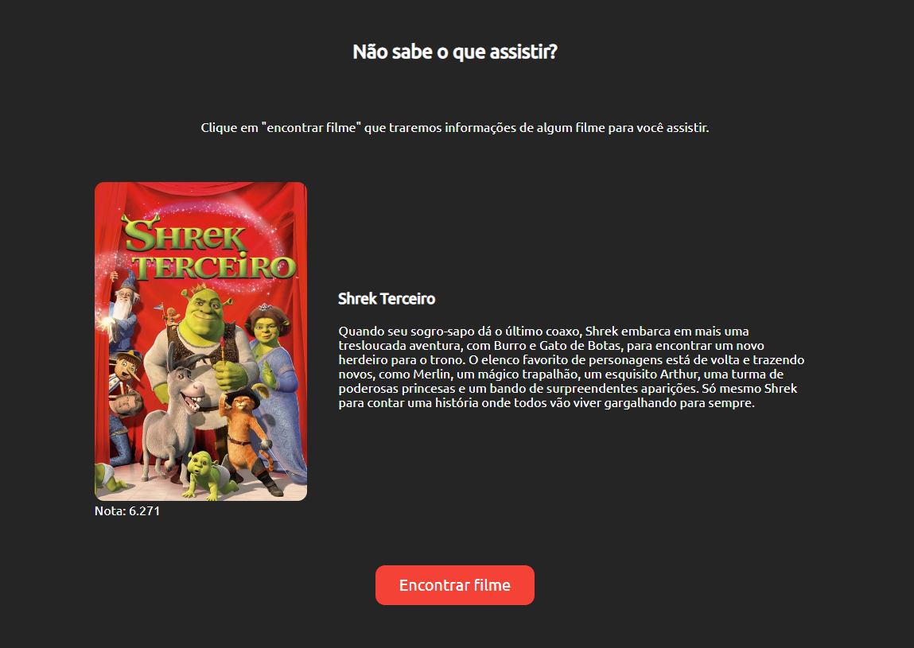

<h1 align="center"> Movies API </h1>

Objetivo do projeto: utilizando a api disponibilizada pelo "The Movie Database", uma base de dados gratuita, fazer um projeto
que apresenta informações de filmes para o usuário escolher qual irá assistir.

  <a href="#-tecnologias">Tecnologias</a>&nbsp;&nbsp;&nbsp;|&nbsp;&nbsp;&nbsp;
  <a href="#-projeto">Projeto</a>

 

  

## 🚀 Tecnologias

Esse projeto foi desenvolvido com as seguintes tecnologias:

- HTML e CSS
- JavaScript e JSON

